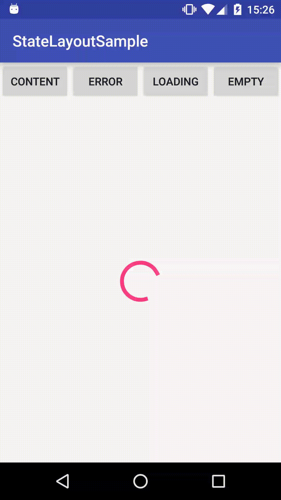

# StateLayout

[](https://github.com/wangyuyan666/StateLayout/actions/workflows/android.yml)
[](LICENSE)

StateLayout is a small Android View container that displays one of four mutually exclusive states: **content**, **empty**, **error**, or **loading**. It is intended for projects that use Android XML layouts and the classic View system.

> **Maintenance status:** active modernization. Version `1.1.0` is being prepared and is not yet published to Maven Central. The historical `1.0.3` Bintray/JCenter artifact should not be used for new builds.



## Why StateLayout?

- One predictable container for four common UI states.
- Configure views in XML or supply them programmatically.
- Preserve the selected state across Android view recreation.
- Java API that is straightforward to call from both Java and Kotlin.
- No runtime dependency on AppCompat or a networking/state-management framework.

## Requirements

| Component | Requirement |
|---|---|
| Library runtime | Android API 8+ |
| Build from source | JDK 17 and Android SDK Platform 36 |
| Sample target | Android API 36 |

## Installation

### Current development version

Until `1.1.0` is published, include this repository as source and depend on its library module:

```groovy
dependencies {
    implementation project(':statelayout')
}
```

The planned Maven coordinate is:

```groovy
implementation 'io.github.wangyuyan666:statelayout:1.1.0'
```

Do not use that coordinate until this README links to a verified Maven Central release. See [the release procedure](docs/RELEASING.md) for the remaining publication work.

## XML configuration

Assign the state views and initial state directly from XML:

```xml
<com.objectlife.statelayout.StateLayout
    xmlns:android="http://schemas.android.com/apk/res/android"
    xmlns:app="http://schemas.android.com/apk/res-auto"
    android:id="@+id/state_layout"
    android:layout_width="match_parent"
    android:layout_height="match_parent"
    app:sl_contentView="@id/content"
    app:sl_emptyView="@id/empty"
    app:sl_errorView="@id/error"
    app:sl_loadingView="@id/loading"
    app:sl_initialState="loading">

    <include android:id="@+id/content" layout="@layout/view_content" />
    <include android:id="@+id/empty" layout="@layout/view_empty" />
    <include android:id="@+id/error" layout="@layout/view_error" />
    <include android:id="@+id/loading" layout="@layout/view_loading" />
</com.objectlife.statelayout.StateLayout>
```

Switch state from Kotlin:

```kotlin
val stateLayout = findViewById<StateLayout>(R.id.state_layout)
stateLayout.setState(StateLayout.VIEW_CONTENT)
```

Or Java:

```java
StateLayout stateLayout = findViewById(R.id.state_layout);
stateLayout.setState(StateLayout.VIEW_ERROR);
```

## Programmatic configuration

Views with no parent are added to the container automatically:

```kotlin
val stateLayout = findViewById<StateLayout>(R.id.state_layout)
val inflater = LayoutInflater.from(this)

stateLayout
    .setContentView(inflater.inflate(R.layout.view_content, stateLayout, false))
    .setEmptyView(inflater.inflate(R.layout.view_empty, stateLayout, false))
    .setErrorView(inflater.inflate(R.layout.view_error, stateLayout, false))
    .setLoadingView(inflater.inflate(R.layout.view_loading, stateLayout, false))
    .initWithState(StateLayout.VIEW_LOADING)
```

For existing descendants, the original ID-based API remains available:

```java
stateLayout.setContentViewResId(R.id.content)
        .setEmptyViewResId(R.id.empty)
        .setErrorViewResId(R.id.error)
        .setLoadingViewResId(R.id.loading)
        .initWithState(StateLayout.VIEW_LOADING);
```

An invalid state or a missing ID passed through the programmatic API fails immediately with an `IllegalArgumentException`. Missing XML references fail during inflation with an `IllegalStateException`. State references declared in XML are resolved after child inflation.

## Build and verify

```bash
./gradlew testDebugUnitTest lintDebug assembleDebug assembleRelease
```

To verify the library's AAR, sources, documentation, and POM locally:

```bash
./gradlew publishReleasePublicationToMavenLocal
```

## Project scope

StateLayout deliberately remains a focused View-system primitive. Networking, pagination, retry policy, and application state ownership belong in higher-level application code. Compose applications generally do not need a wrapper around conditional composition; a future Compose sample may demonstrate interoperability without replacing this library's View API.

## Contributing and support

- Read [CONTRIBUTING.md](CONTRIBUTING.md) before proposing a public API change.
- Use the issue templates for reproducible bugs and focused feature requests.
- See [ROADMAP.md](ROADMAP.md) for planned work.
- See [SECURITY.md](SECURITY.md) for private vulnerability reporting.
- All participants must follow [CODE_OF_CONDUCT.md](CODE_OF_CONDUCT.md).

## 中文简介

StateLayout 是面向 Android XML/View 项目的轻量状态容器，用于在内容、空数据、错误和加载四种界面之间切换。项目正在恢复维护；`1.1.0` 正在准备中，正式发布前请通过源码模块引用。构建、测试、贡献和发布要求见上方文档。

## License

Copyright 2016 objectlife and StateLayout contributors.

Licensed under the [Apache License 2.0](LICENSE).
